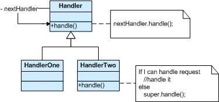

[Поведенческие шаблоны](../#readme) / Цепочка обязанностей

# Цепочка обязанностей (Chain of responsibility)

##  Описание паттерна

Формирует цепочку из обработчиков запроса, в которой каждый обработчик может что-либо сделать или не сделать с сообщением, но обязательно передает его следующему обработчику.

Получается черный ящик, в который поступает запрос, а возвращается обработанный ответ.

Разделяет отправителя запроса и его получателя, помогая избежать их зависимости. Разделяет запрос и его обработчик.

Обеспечивает конвейерную обработку запроса.

Полезен, если запросов много, а обработчики у них могут быть разные (или одни и те же).

Упрощает структуру программы: каждый объект хранит всего одну ссылку на следующий элемент цепочки.

Убедитесь, что все некорректно обработанные запросы отлавливаются.

##  Реализация паттерна

##  Примеры

* [Расчет скидки на продукты](./shopping#readme)
* [Выдача денег в банкомате](./cashMachine#readme)

##  Похожие паттерны

* [Команда (Command)](../command#readme)
* [Посредник (Mediator)](../mediator#readme)
* [Наблюдатель (Observer)](../observer#readme)

Эти паттерны позволяют отделить отправителя и получателя запроса.

##  Взаимодействие с другими паттернами

* [Компоновщик (Composite)](../../structural/composite#readme). Родитель компонента может быть его преемником в цепочке.
