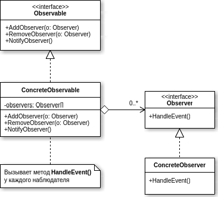

[Главная](../..) / [Поведенческие шаблоны](..)

# Наблюдатель (Observer)

## Другие названия

* `Подчинённые` (`Dependents`)

## Описание

Реализует механизм **наблюдения за состоянием** других объектов.

## Реализация паттерна



Есть субъект, у которого есть некоторое состояние. Это состояние может изменяться.

Есть несколько объектов, состояние и действия которых ЗАВИСЯТ от состояния субъекта. Они хотели бы знать, когда меняется субъект, чтобы как-то отреагировать на эти изменения.

Между элементами формируется зависимость один ко многим.

**Субъект** должен уметь:

* *регистрировать наблюдателей*, которые хотят знать о его состоянии
* опционально - *удалять наблюдателей*
* *оповещать зарегистрировавшихся наблюдателей* при изменениях - вызывать у каждого наблюдателя метод update

**Объект** должен иметь метод ```update()```, который будет вызываться субъектом при изменениях.

Таким образом, между субъектом и наблюдателями устанавливается *слабая связанность только на уровне интерфейсов* (метод регистрации и метод обновления).

Шаблон наблюдателя - это, обычно, отдельный интерфейс (реже родительский класс), который может расширяться абсолютно любым другим классом.

При обновлении состояния есть два пути передачи данных наблюдателю:

* прямой - как аргумент метода ```Update```
* косвенный - когда наблюдатель сам запрашивает нужные данные после уведомления об изменениях. В этом случае нужно предусмотреть у субъекта методы для получения данных.

## Примеры

* [Метеостанция](./meteostation)
