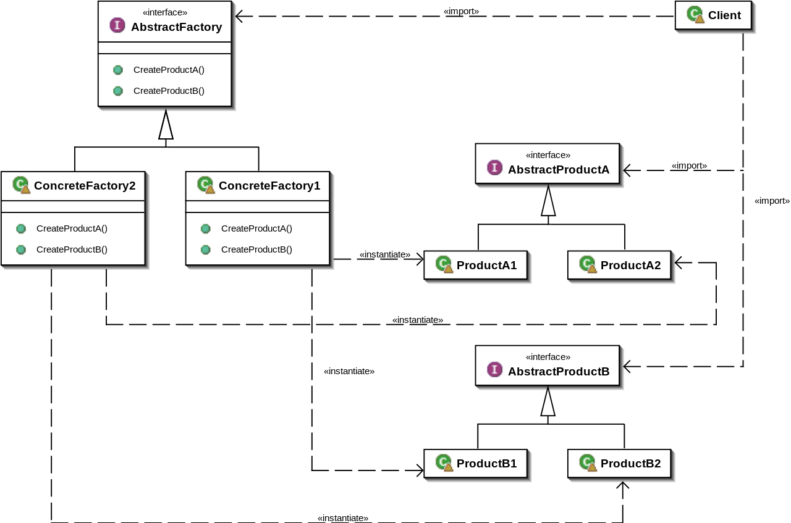

[Порождающие шаблоны](../#readme) / Абстрактная фабрика

# Абстрактная фабрика (Abstract factory)

## Содержание

* [Описание паттерна](#-описание-паттерна)
* [Реализация паттерна](#-реализация-паттерна)
* [Примеры](#-примеры)
* [Использование](#-использование)
* [Преимущества](#-преимущества)
* [Недостатки](#-недостатки)
* [Похожие паттерны](#-похожие-паттерны)
* [Взаимодействие с другими паттернами](#-взаимодействие-с-другими-паттернами)
* [Источники](#источники)

##  Описание паттерна

### Абстрактная ситуация. Стулья и стили

Вы занимаетесь дизайном помещений. В каждом проекте обязательно должны быть жизненно необходимые предметы: стол, стул и шкаф. При этом для стиля Модерн и для стиля Классицизм - это должны быть разные стол, стул и шкаф.

Как вам не запутаться в подборе предметов для разных стилей?

Здесь можно выделить две проблемы:

* однообразие - стул в стиле Модерн не должен соседствовать с Классическим шкафом.
* комплектация - в каждом наборе обязательно должны быть все три предмета.

Лучше, если подбор таких комбинаций будет абстрагирован в отдельную фабрику. ФабрикаМодерн будет производить только предметы мебели в стиле Модерн. ФабрикаКлассицизм - только предметы мебели в стиле Классицизм. Так мы решаем проблему однообразия наборов.

Теперь нужно проследить, чтобы каждая фабрика умела производить все необходимые предметы. Просто объединим эти фабрики в одну иерархию и определим для них одинаковый интерфейс.

***

Паттерн `Абстрактная фабрика` позволяет создавать целые **семейства взаимосвязанных объектов**. Он определяет общий интерфейс для целой группы разных *отдельных фабрик*, каждая из которых предоставляет нужный набор объектов.

Набор объектов - одинаковый (стол, стул, шкаф), а типы - разные (модерн или классика).

Абстрактная фабрика позволяет **координировать работу таких отдельных (конкретных) фабрик**, обеспечивает для них одинаковый интерфейс, контролирует набор типов объектов, которые нужно создать.

##  Реализация паттерна

* Иерархия фабрик
  * Интерфейс `AbstractFactory` объявляет методы для создания каждой из нужных групп объектов (`CreateProductA`, `CreateProductB`).
  * Классы конкретных фабрик (`ConcreteFactory1`, `ConcreteFactory2`) реализуют методы создания каждой из нужных групп объектов.
* Иерархия продуктов
  * Для каждой группы объектов (`ProductA`, `ProductB`) создаются *свои деревья наследования*. Это позволяет сохранить одинаковый интерфейс для разных объектов одной группы.
* Каждая `конкретная фабрика` САМА определяет, как и какой именно объект ей создавать.

Объект `Конкретной фабрики` обычно создается при запуске программы в зависимости от некоторой конфигурации или окружения.

##  Примеры

* [Фабрика пиццы](./pizza#readme)
* [Кросс-платформенный интерфейс](./gui#readme)

##  Использование

* В программе много продуктов разных видов, которые необходимо объединять в группы.
* Эволюция `Фабричного метода` при добавлении новых типов продуктов.

##  Преимущества

* Обеспечивает сочетаемость продуктов в группе/наборе.
* Убирает лишние связанности (клиентский код не зависит от классов конкретных продуктов).
* Сводит весь код производства групп продуктов в одно место.
* Упрощает добавление новых продуктов.

##  Недостатки

* Много классов, большие иерархии.
* Для каждого набора необходимо наличие всех продуктов (даже если они "пустые").

##  Похожие паттерны

* [Строитель (Builder)](../builder#readme). Фабрика с более тонкой настройкой.
* [Фабричный метод (Factory method)](../factoryMethod#readme). Производство одного продукта.
* [Фасад (Facade)](../../structural/facade#readme). Простой интерфейс для множества объектов/операций.

Абстрактная фабрика часто является эволюцией паттерна `Фабричный метод` при увеличении количества продуктов в программе.

##  Взаимодействие с другими паттернами

**Использование паттерна в структуре другого паттерна (один паттерн является частью другого)**

* [Фабричный метод (Factory method)](../factoryMethod#readme), [Прототип (Prototype)](../prototype#readme). Используются в `Конкретных фабриках` для производства `Конкретных продуктов`.

**Способы реализации паттерна (вариации механизмов работы паттерна)**

* [Мост (Bridge)](../../structural/bridge#readme).
* [Одиночка (Singleton)](../singleton#readme). `Абстрактная фабрика` может быть `Синглтоном`.

## Источники

* [refactoring.guru](https://refactoring.guru/ru/design-patterns/abstract-factory)
