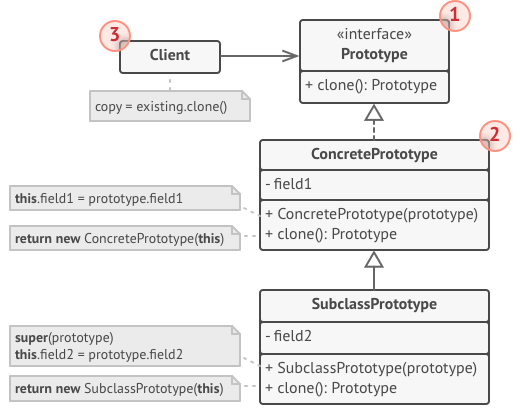
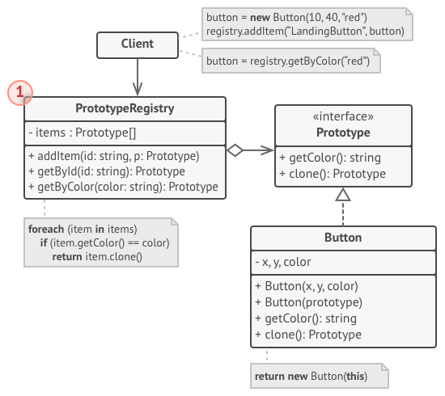

[Порождающие шаблоны](../#readme) / Прототип

# Прототип (Prototype)

## Другие названия

* **Клон** (Clone)

## Содержание

* [Описание паттерна](#-описание-паттерна)
* [Реализация паттерна](#-реализация-паттерна)
* [Примеры](#-примеры)
* [Использование](#-использование)
* [Преимущества](#-преимущества)
* [Недостатки](#-недостатки)
* [Похожие паттерны](#-похожие-паттерны)
* [Взаимодействие с другими паттернами](#-взаимодействие-с-другими-паттернами)
* [Источники](#источники)

##  Описание паттерна

Создает новые объекты путем **копирования существующего экземпляра-прототипа** вместо создания через конструктор.

Воплощает принцип программирования через интерфейсы.

В паттерне `Прототип` копирование объекта - это задача самого объекта. Только он знает о своей внутренней структуре и свойствах, которые нужно скопировать.

**Позволяет**:

* избежать использования конструктора - это может быть затратно, так как вызываются конструкторы всей иерархии предков.
* избежать наследования создателя объекта, как это делает [Абстрактная фабрика (Abstract factory)](../abstractFactory#readme).
* копировать объекты, не зная ничего об их устройстве.

Паттерн удобен, если *нет разницы, как именно создаются объекты*:

* динамическое определение инстанцируемых классов;
* нужно избежать создания иерархий классов или фабрик и параллельных иерархий;
* экземпляры класса могут находиться в нескольких состояниях и удобнее создать несколько прототипов, а не инстанцировать класс вручную в нужном состоянии.
* создание объекта требует проведения каких-то сложных операций, поэтому целесообразнее клонировать уже созданный объект

### Хранилище прототипов

Уже созданные и готовые к клонированию прототипы можно хранить в отдельной хеш-таблице.

##  Реализация паттерна

* `Prototype` - интерфейс, определяющий метод `clone()`.
* `ConcretePrototype` - конкретные реализации паттерна со своими методами `clone()`.

Первый объект создается с помощью конструктора. Остальные копируются с него.

### Реализация с хранилищем

##  Примеры

* Весь JavaScript основан на шаблоне `Прототип` - на основе исходного объекта создаются его пустые клоны.
* [Копировальная машина](./copy#readme)

##  Использование

* Код не должен зависеть от классов копируемых объектов (особенно, если эти объекты приходят извне).

##  Преимущества

* Чтобы создать объект, не нужно знать, как он устроен (особенно полезно для сложных объектов).
* Ускоряет создание объектов.

##  Недостатки

* Трудности при работе со ссылками (если объект имеет ссылки на другие объекты).

##  Похожие паттерны

* [Фабричный метод (Factory method)](../factoryMethod#readme). Создание объекта через конструктор.
* [Хранитель (Memento)](../../behavioral/memento#readme). Копирует текущее состояние объекта.

##  Взаимодействие с другими паттернами

* Использование паттерна в структуре другого паттерна (один паттерн является частью другого)
  * [Абстрактная фабрика (Abstract Factory)](../abstractFactory#readme). Может использовать `Прототип` для непосредственного создания классов.
* Способы реализации паттерна (вариации механизмов работы паттерна)
  * [Одиночка (Singleton)](../singleton#readme). `Прототип` может быть `Синглтоном`.
* Частое применение (паттерны не связаны напрямую)
  * [Команда (Command)](../../behavioral/command#readme). `Прототип` позволяет копировать `Команду` для вставки в историю выполненных команд.
  * [Компоновщик (Composite)](../../structural/composite#readme), [Декоратор (Decorator)](../../structural/decorator#readme) и другие сложные архитектуры. `Прототип` позволяет клонировать сложные структуры вместо того, чтобы собирать их заново.

## Источники

* [refactoring.guru](https://refactoring.guru/ru/design-patterns/prototype)
