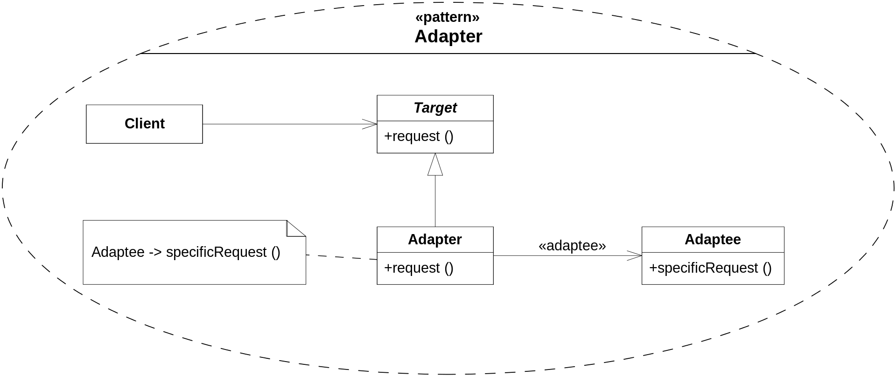

[Главная](../..) / [Структурные шаблоны](..)

# Адаптер (Adapter)

## Описание

Если кто-то ходит, как утка, и крякает, как утка, то это ~~и есть~~ может быть ~~утка~~ индюшка с утиным адаптером...

Если объект, с которым нужно взаимодействовать, не удовлетворяет требованиям клиента и не подлежит изменению (сторонняя библиотека), с помощью адаптера ему можно *"прикрутить" необходимый интерфейс*.

Паттерн `Адаптер` **изменяет интерфейс** объекта без изменения его внутреннего кода.

## Реализация паттерна



* `Adaptee` - исходный класс с неподходящим интерфейсом (метод `specificRequest()`)
* `Adapter` - адаптер, оборачивающий исходный класс и предоставляющий ожидаемый интерфейс (в методе `request()` вызывается метод `specificRequest` исходного класса)
* `Target` - конечный объект с ожидаемым интерфейсом (метод `request()`).

## Примеры

* Вася из Питера, а Петя из Москвы. Вася просит Петю ```слезтьСПоребрика()```, но Петя его не понимает. Если бы Петя знал, что Вася просит его просто сойти с бордюра, он бы легко это сделал, потому что У Пети есть встроенная функция ```cойтиСБордюра()```. Этим двоим просто нужен адаптер.
* [Проблема с печеньками](./cookies)

## Похожие шаблоны

Шаблон `Адаптер` меняет интерфейс исходного объекта.

* [Декоратор (Decorator)](../decorator) - дополняет интерфейс исходного объекта.

  Адаптер очень похож на `Декоратор` по структуре. Он тоже принимает некоторый объект и "оборачивает" его. Но основная роль Адаптера - *не дополнить функциональность* объекта, а вызвать необходимый метод. Предполагается, что объект все умеет сам, просто не понимает, чего от него хотят.

* [Заместитель (Proxy)](../proxy) - сохраняет интерфейс исходного объекта.


