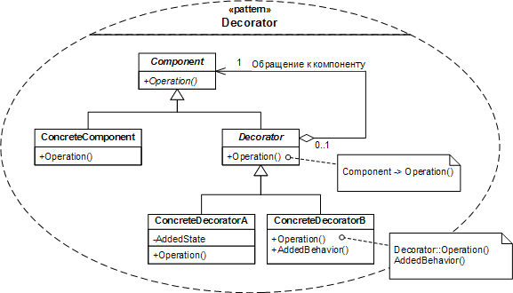

[Структурные шаблоны](../#readme) / Декоратор

# Декоратор (Decorator)

## Другие названия

* `Обертка` (`Wrapper`)

##  Описание паттерна

### Абстрактная ситуация. Система оповещений

Вы разработали систему оповещений, которая может отслеживать различные события и отсылать пользователю сообщение по электронной почте.

Потом вы добавили в нее возможность слать сообщения в facebook, реализовав их как отдельный подкласс. Теперь ваша программа при инициализации выбирает нужную [Стратегию (Strategy)](../../behavioral/strategy#readme) и использует ее.

Но вдруг пользователи захотели, чтобы была возможность слать оповещения и на почту и в facebook одновременно. Если у вас всего два подкласаа - никаких проблем, можно создать дополнительно их комбинацию. А если таких стратегий десять?

Лучше, чтобы была возможность добавлять нужные опции при необходимости - или не добавлять вообще.

***

Позволяет добавить объекту **дополнительное поведение**, *не изменяя его код*.

Является удобной и гибкой альтернативой субклассированию.

Декоратор обычно **ДОПОЛНЯЕТ** поведение оборачиваемого компонента, а **НЕ ЗАМЕНЯЕТ** его.

Декораторов может быть много - один поверх другого. Это просто, так как задекорированный объект выглядит точно так же как незадекорированный.

##  Реализация паттерна

* `Component` - общий интерфейс для компонентов и декораторов.
* `ConcreteComponent` - класс компонента
* `Decorator`, `ConcreteDecoratorA`, `ConcreteDecoratorB`
  Декоратор реализует тот же интерфейс, что и компонент, который он оборачивает (может являться сестринским классом для этого компонента - *субклассировать тот же абстрактный класс*). Таким образом, другой объект **не видит разницы между исходным компонентом и компонентом в обертке**.

Декоратор получает компонент, который нужно обернуть, выполняет свои дополнительные действия и вызвает нужный метод самого компонента (последовательность этих операций может быть любой - до, после, до и после вызова самого компонента).

Обычно и сам компонент, и все декораторы наследуют от одного класса, так как у них должен быть одинаковый интерфейс.

##  Примеры

* [Кофе с добавками](./coffee#readme)
* Матрешка
* Одежда

##  Использование

* Необходимо добавить какому-то объекту функциональности, но нельзя по каким-либо причинам изменять его код.

##  Преимущества

* Гораздо более гибкий механизм, чем наследование.
* Можно изменять функционал на лету.

##  Недостатки

* Много маленьких классов.
* Трудно конфигурировать многократно обернутые объекты.

##  Похожие паттерны

Шаблон `Декоратор` дополняет интерфейс исходного объекта.

* [Адаптер (Adapter)](../adapter#readme) - меняет интерфейс исходного объекта.
* [Заместитель (Proxy)](../proxy#readme) - сохраняет интерфейс исходного объекта.
* [Компоновщик (Composite)](../composite#readme). Также использует рекурсивную вложенность для связи большого количества объектов в одну структуру.
* [Цепочка обязанностей (Chain of Responsibility)](../../chainOfResponsibility#readme). Также построена на рекурсивном выполнении операций.

##  Взаимодействие с другими паттернами

**Способы реализации паттерна (вариации механизмов работы паттерна)**

* [Прототип (Prototype)](../../creational/prototype#readme). Позволяет клонировать сложные структуры компоновщика.

## Источники

* [refactoring.guru](https://refactoring.guru/ru/design-patterns/decorator)
* [wikipedia](https://ru.wikipedia.org/wiki/%D0%9A%D0%BE%D0%BC%D0%BF%D0%BE%D0%BD%D0%BE%D0%B2%D1%89%D0%B8%D0%BA_(%D1%88%D0%B0%D0%B1%D0%BB%D0%BE%D0%BD_%D0%BF%D1%80%D0%BE%D0%B5%D0%BA%D1%82%D0%B8%D1%80%D0%BE%D0%B2%D0%B0%D0%BD%D0%B8%D1%8F))
